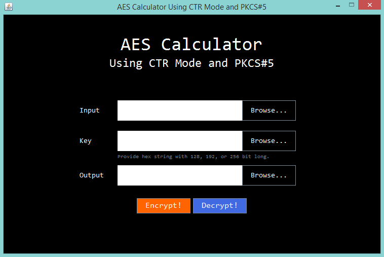

AES Calculator Using CTR Mode and PKCS#5
===

## Description

    This AES Calculator Using CTR Mode and PKCS#5 is a simple application that makes it easy to encrypt and decrypt your private data, such as photos, videos, and other documents without sacrificing ability to browse through them. This AES calculator uses standard AES-128, 192, or 256 bit encryption decryption. When you open this calculator, you will be asked to browse some files and locate the output file.

    Working best at Java SDK version 1.8.

## Usage
1. Open and run `AES-CTR.jar`.
2. Choose the file you want encrypt or decrypt by using the first `Browse...` button to select the input file to upload.
3. Choose the file that contains key by using the second `Browse...` button to select the input file to upload. 
4. After that, you have to choose path location for your output file - a file encryption or decryption result. 
5. Finally, choose the operation you want to do, `Encrypt!` or `Decrypt!` button, depending on whether you want the input file to be encrypted or decrypted. 

## Download Now
You can download this code in [here](https://github.com/salsanads/AES-CTR) and jar in [here](http://bit.ly/AES-CTR).

